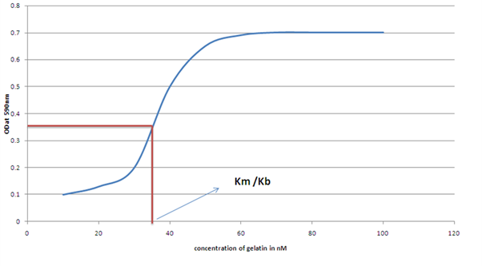

### Theory
 
Within the tissues of animals, most cells contact and interact specifically with other cells via various cellular junctions. They also bind to the extracellular matrix, a complex network of secreted proteins and carbohydrates playing a major role in communication between cell and its environment. Cell attachment assays measure adhesion between cells or between a cell and a surface or extracellular matrix.

The biological processes involved in adhesion are complex, involving molecular interactions, ligand binding, and intracellular signalling affecting different cell processes such as growth, differentiation, and metastases. Cell adhesion assays have applications in many areas of disease research:  cancer, inflammation, neurodegenerative diseases for examples.
 
Cell adhesion assays provide valuable insight into many aspects of cell physiology. Specific cell adhesion receptors are present  which facilitate binding to the matrix components. Many signaling pathways are initiated by ligand binding and may regulate the cell matrix interactions and also stimulates cellular response like proliferation, migration and modulation of gene expression. Many of the normal processes like differentiation, embryonic development and wound healing are contributed by cell matrix interactions.
 
 

&nbsp;
 

One of the most common types of cell adhesion assay is the integrin-mediated assay. The integrins are a family of cell surface receptors that mediate attachment of the cell to other cells or to its extracellular matrix. The extracellular matrix consists of a framework of proteins and proteoglycans that interact with cell surface receptors. Integrin also passes signal through to the cell regarding its outside environment. Common ligands of integrins within the extracellular matrix are fibronectin, vitronectin, collagen, and laminin.
 

Collagens are the most abundant proteins in animals and consists of 27 proteins. Collagens are organized into triple helical coiled coils consisting of three subunits.They are found in the connective tissues of mammals and they provide structural support to the tissues . They contain repeating units of Gly-X-Y sequences.
 
 
Fibronectins are glycoproteins of the extracellular matrix which can bind to integrins, collagens, fibrins and heparan sulfate proteoglycans. They are synthesized by cell types like fibroblasts, hepatocytes and endothelial cells. They are of two types:soluble plasma fibronectin and insoluble cellular fibronectin. The soluble form is found in tissue fliuds like plasma, cerebrospinal fluids, amniotic fluids. The insoluble fibronectin can form fibres in the extracellular matrix. Integrins bind to the Arg-Gly-Asp (RGD) sequence of fibronectins.
 
Vitronectin is a 75kDa glycoprotein found in the extracellular matrix.  They are found in blood plasma and in wounded areas.  It is synthesized by the liver and is secreted into the bloodstream. It binds to collagen, integrins, extracellular proteases, and clotting factors. Laminins are glycoproteins that are secreted into the matrix and are found in the basal lamina.  It consists of 3 polypeptide subunits and forms a triple helical coiled coil. They are heterotrimers composed of an α-chain, a β-chain, and a γ-chain. 

Integrins are the most abundant proteins of the extracellular matrix and the best-characterised of the cell adhesion receptors.  They are composed of α (alpha) and β (beta) subunits. The extracellular region of the subunits binds to the ECM proteins, and the cytoplasmic region binds to cytoskeletal and signalling proteins. There are multiple types of α (alpha) and β (beta) subunits, which combine to form at least 24 different heterodimeric receptors. 
 
&nbsp;

### Principle
 
 Most commonly the quantitation of cell adhesion can be done by two kinds of assays: cell attachment assays and cell spreading assays. Cell attachment assays enable one to quantify the fraction of cells that can attach to matrix-coated surfaces.  Cells are plated on a cell culture plate coated with different concentrations of the ligand for one to two hours. Unbound cells are washed away with phosphate buffer and the bound cells are fixed, washed, and stained with suitable dye (crystal violet). After washing the excess stain, the bound dye is dissolved in acetic acid and measured by its absorbance at 590nm. Half-maximal binding affinity is calculated from the plotted curve (cells attached vs ligand concentration).
 
